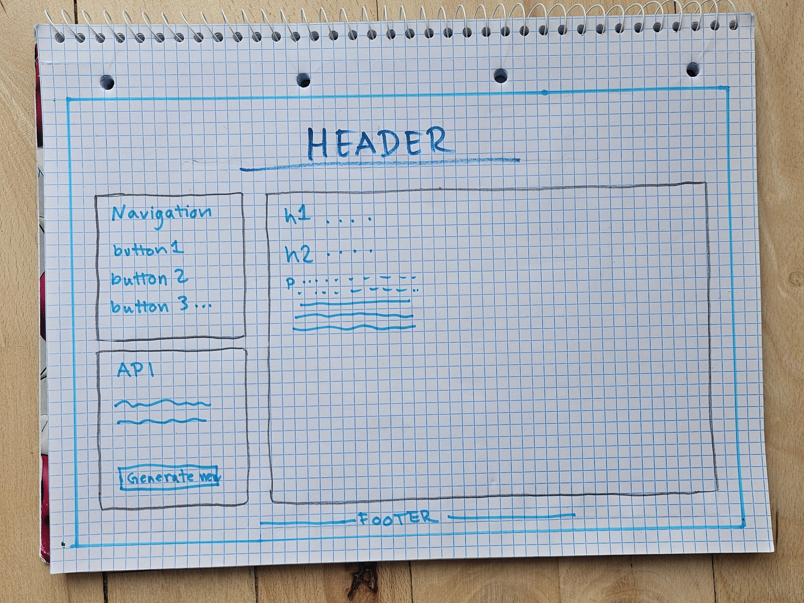

# Reflections on Creating My Website

Before taking this course, I had not given much thought on how websites were constructed, other than being overwhelmed by how complicated I had perceived it to be. Throughout the semester, taking the course in Digital Technologies in Humanities, I gradually learned how these technologies and coding languages work, and how they can be  used in conjunction to create a functioning and nice looking website. Creating my own website as part of the course gave me the opportunity to gain more confidence in different kinds of coding and understand how to use a type of digital technologies in my own humanities field of study.

## HTML

HTML was the first part of website development that was introduced in the course that I had to get familiar with. At first, it seemed overwhelming, all the different tags, elements, names, and values that make up the structure and content of a website.  
When creating my website, I used different HTML elements to divide the page into a solid structure. The main parts being a **header**, and **divider** for an advice API, a **nav** element for navigation around the page, a **main** for holding all my **markdown** content, and finally a **footer**. Getting these elements into place, helped me understand the basic structure and gave me a blank template to work with. In that sense, my HTML is quite simple, but it took many itterations before coming to the final result.  
A main part of my HTML is my "div class=”container”. Inside of this container, I placed the visible contents of my website. This was to bind them all together for my CSS code. 

## CSS

After learning the basics of HTML, I began experimenting with CSS to change the appearance of my website. Initially, I just understood CSS mainly as something that changes colours and fonts. However, working with it and learning about it through the course, I found that it can be used to control the entire layout of a webpage.  
For my website, I used a **grid** layout to create the main layout. The .container, which I defined in HTML as a separate class, is what I used to create both rows and columns in which to place the rest of my website **body**. The reason I chose to use a grid rather than a **flex**, was the limitation of the flex box. I had from the beginning, before doing any of the CSS, made a sketch on how I wanted my website to look, which can be seen on the picture below, and I was determined to make it live up to that.

As seen on my sketch, I wanted the layout to be in two dimensions, rows and columns. I took inspiration from W3 schools, where I learned that the flex box only functions in one dimension, either rows or columns, so I decided to experiment with a grid instead. In my CSS, the .container is defined as a grid with two columns. The first column is 250 pixels wide, while the second column uses the remaining space on the right side: ‘grid-template-columns: 250px auto’. I wanted to define the size of the first column to make it much smaller than the second, since the navigation and API needed much less space than this column, where all my markdown files are deployed to.  

## JavaScript and APIs

A part I had the most trouble with was JavaScript and integrating it into my HTML code. The learning curve was steeper, but during the course, we had the opportunity to experiment with different functions. Having written my text content for the website in separate Markdown files, I had to display them onto the website. For this, I am using the loadMarkdown function: async function loadMarkdown(filename, ComponentId). The function parameters are *filename*, the name of the Markdown file to load, and the *ComponentId*, the ID of the HTML element where the content is going to be displayed. I defined the component ID in the main part of my HTML, where I created a section with the ID “content”. Then i used **button** elements in my navigation section to navigate between the Markdown pages. The buttons use an **onclick** attribute that calls on the loadMarkdown() function when clicked, and using the element ID “content”, they are displayed in the "section id=”content”" area.

## Final Reflections

The biggest part of what I am taking away from this course, is that creating a website is much more understandable once you break the process down into smaller parts. I also found that the process involved a great amount of problem-solving. The course introduced computational thinking through ideas such as decomposition, pattern recognition, abstraction, and algorithm design. The decomposition was especially relevant for my process, as I approached the problems that showed up along the way. 
