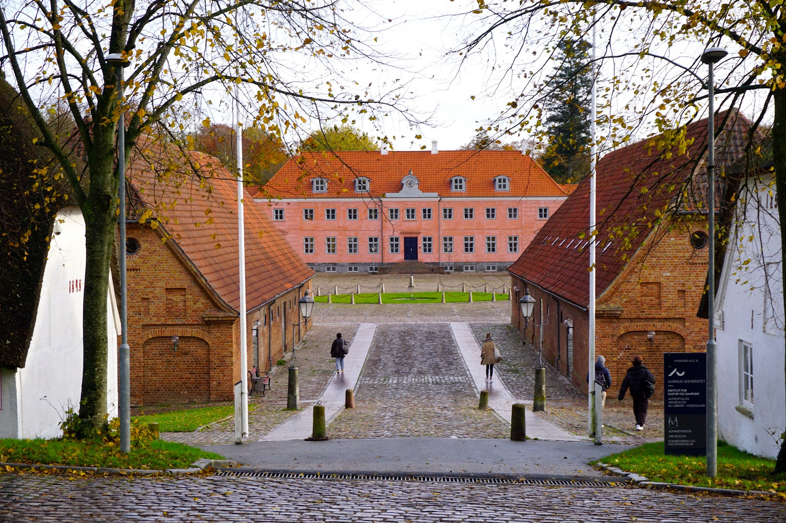

# Sustainable Heritage Management

## Master’s Programme

**Sustainable Heritage Management** (SHM) is a Master's programme at Aarhus University, located at the Moesgaard campus. It is part of the heritage studies field, combining theoretical and practical frameworks from different fields, such as archaeology, anthropology, museum studies, history, and many more. As it combines all these fields of studies, it is very much an interdisciplinary field that concerns itself with understanding, protecting, and managing cultural and natural heritage in ways that are socially and environmentally responsible. 

### Sustainability in Heritage Management
Sustainability as a concept is central to the programme. When we think of sustainability we most often refer to environmental responsibility and ecological changes, however in SHM it also relates to cultural continuity, social inclusion, and community participation. As such, this degree focuses on sustainability in both an environmental and social context when dealing with issues concerning the preservation of- and care for different types of heritage. It deals with micro-scale social dynamics (the local, community level) and macro-scale global policies (international conventions). SHM seeks to find a balance when it comes to conservation within a changing world, while adapting to the contemporary challenges such as climate change, urbanization, globalization, and tourism.

### Heritage as a Concept
Heritage can be defined simply as "that which we inherit from the past and pass on to the future," but addition to that definition it is important to keep in mind that heritage is not only something made in the past: heritage is always in the making (Shepherd. N. 2023). Therefore, rather than just viewing heritage as simply monuments, archaeological sites, collections in museums, or historical architecture, the field of SHM understands heritage as something that is continuously created, interpreted, and negotiated by people. While heritage is also largely about preserving the past, it is also importantly about understanding how the past shapes contemporary identities and communities.  
Heritage therefore encompasses tangible articfacts, such as buildings and physical items, as well as the intangible, such as traditions and cultural practices that contribute to cultural continuity (UNESCO, 2003; UNESCO, 1972).

## Bibliography
- Shepherd. N. 2023. ‘Introduction: Rethinking Heritage in Precarious Times’, in: N Shepherd. Rethinking Heritage in Precarious Times: Coloniality, Climate Change and Covid-19. London: Routledge. Pp. 1-14
- https://masters.au.dk/sustainableheritagemanagement
- UNESCO. (1972). Convention Concerning the Protection of the World Cultural and Natural Heritage. https://whc.unesco.org/en/convention/
- UNESCO. (2003). Convention for the Safeguarding of the Intangible Cultural Heritage. https://ich.unesco.org/en/convention
